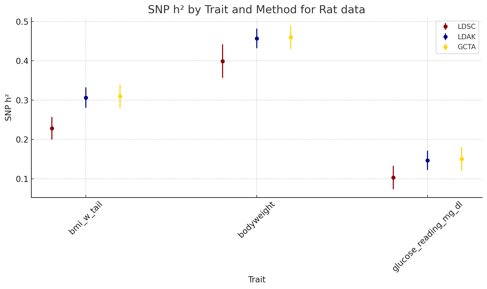

# SNP Heritability Estimates Comparison for Rat Data

We noticed that the SNP heritability estimates for the trait `bodyweight` was highest across the methods. We also found that the method `GCTA` consistently provided higher heritability estimates across all traits.

## Heritability Estimates Comparison Plot

## Method Comparison

- **LDSC (Linkage Disequilibrium Score Regression):** Assumes that all SNPs contribute equally to heritability, leveraging linkage disequilibrium (LD) patterns to estimate heritability from GWAS summary statistics. This method might be more conservative in estimating heritability, especially for traits with complex genetic architectures.
  
- **LDAK (Linkage Disequilibrium Adjusted Kinships):** Attempts to weight SNPs by their contribution to the genetic variance, potentially providing higher heritability estimates for traits influenced by SNPs with larger effects.

- **GCTA (Genome-wide Complex Trait Analysis)** utilizes a mixed linear model approach to estimate the genetic variance explained by all SNPs for a particular trait. This method often yields higher estimates, which might be attributed to its ability to capture variance from a wider range of SNP effects, including those with small to moderate effects that are pervasive across the genome.

## Trait-Specific Comparisons

- For the trait `bmi_w_tail`, LDAK estimates a heritability of 0.306, compared to LDSC's estimate of 0.228, resulting in a difference of 0.078 in favor of LDAK.
- For `bodyweight`, LDAK's heritability estimate is 0.457, while LDSC's is 0.399, leading to a difference of 0.058 in favor of LDAK.
- For `glucose_reading_mg_dl`, LDAK estimates heritability at 0.147, compared to LDSC's 0.103, with a difference of 0.044 in favor of LDAK.

These comparisons suggest that for each trait analyzed, LDAK tends to provide higher heritability estimates than LDSC. This difference could be attributed to LDAK's approach to weighting SNPs by their contribution to genetic variance, which may capture more of the heritable variation for traits influenced by SNPs with larger effects. LDSC's assumption that all SNPs contribute equally to heritability, on the other hand, might lead to more conservative estimates, especially for traits with a complex genetic architecture involving both common and rare variants with varying effect sizes.

These findings underscore the importance of considering the genetic architecture of the traits being studied and the assumptions underlying each method when interpreting heritability estimates.

## References

- Speed, D., Holmes, J. & Balding, D.J. Evaluating and improving heritability models using summary statistics. *Nat Genet* 52, 458–462 (2020). [https://doi.org/10.1038/s41588-020-0600-y](https://doi.org/10.1038/s41588-020-0600-y)
- Zhang, Q., Privé, F., Vilhjálmsson, B. et al. Improved genetic prediction of complex traits from individual-level data or summary statistics. *Nat Commun* 12, 4192 (2021). [https://doi.org/10.1038/s41467-021-24485-y](https://doi.org/10.1038/s41467-021-24485-y)

